# ANALISIS LENGKAP TUGAS BESAR PBO — Bespoke Travel CRM
### Sistem Manajemen Follow-Up Calon Jemaah Umroh

> Dokumen ini dihasilkan berdasarkan reverse engineering seluruh source code pada workspace `d:\umroh-bespoke`.

---

# TAHAP 1 — ANALISIS SISTEM

## 1.1 Identitas Aplikasi

| Aspek | Detail |
|---|---|
| **Nama Aplikasi** | Jemaah Follow-Up Management System (Bespoke Travel CRM) |
| **Tujuan** | Mengelola pipeline calon jemaah umroh dari prospek awal hingga closing pembayaran |
| **Latar Belakang** | Travel umroh membutuhkan sistem CRM untuk melacak prospek, menjadwalkan follow-up, memantau status komunikasi, dan merekam transaksi closing secara terpusat |
| **Masalah yang Diselesaikan** | 1. Follow-up calon jemaah yang tidak terorganisir<br>2. Kehilangan prospek karena tidak di-follow up tepat waktu<br>3. Tidak ada pencatatan konversi dari prospek ke closing<br>4. Tidak ada dashboard monitoring performa staff |

## 1.2 Role Pengguna

| Role | Deskripsi | Hak Akses |
|---|---|---|
| **Admin** | Pengelola utama sistem | • CRUD semua data calon jemaah (termasuk milik staff lain)<br>• CRUD jadwal follow-up<br>• CRUD status komunikasi<br>• Melihat laporan closing<br>• **CRUD user/pengguna (khusus admin)**<br>• Dashboard statistik global<br>• Settings |
| **Staff** | Konsultan travel / agen | • Melihat calon jemaah yang di-assign kepadanya saja<br>• Melihat jadwal follow-up miliknya<br>• Mengupdate status komunikasi<br>• Dashboard statistik personal<br>• Melihat aktivitas sendiri |

## 1.3 Daftar Fitur Lengkap

### Fitur Admin
1. **Login/Logout** — Autentikasi JWT dengan form admin/staff terpisah
2. **Dashboard** — Statistik: total jemaah, follow-up hari ini, total closing, conversion rate; chart follow-up activity & closing per bulan; tabel recent follow-up
3. **Data Calon Jemaah** — CRUD lengkap (tambah, edit, hapus, detail); filter & pagination
4. **Jadwal Follow-Up** — Membuat & mengelola jadwal follow-up untuk calon jemaah; assign staff
5. **Status Komunikasi** — Mencatat hasil komunikasi setiap follow-up; otomatis update pipeline
6. **Laporan Closing** — Mencatat transaksi closing; otomatis dibuat ketika status = "Closing"
7. **Manajemen Pengguna** — CRUD user (admin only); aktivasi/deaktivasi akun
8. **Settings** — Pengaturan profil, ubah password
9. **Activity Log** — Riwayat aktivitas sistem

### Fitur Staff
1. **Dashboard Staff** — Statistik personal
2. **Jemaah Saya** — Data calon jemaah yang di-assign ke staff tersebut
3. **Jadwal Follow-Up** — Jadwal follow-up milik staff
4. **Status Komunikasi** — Input/update status hasil follow-up
5. **Aktivitas Saya** — Log aktivitas staff

## 1.4 Flow Bisnis Aplikasi

```
                        ┌─────────────────┐
                        │   LOGIN (JWT)   │
                        └────────┬────────┘
                                 │
                    ┌────────────┴────────────┐
                    ▼                         ▼
             ┌──────────┐             ┌──────────┐
             │  ADMIN   │             │  STAFF   │
             └────┬─────┘             └────┬─────┘
                  │                        │
    ┌─────────────┼─────────────┐         │
    ▼             ▼             ▼         ▼
┌────────┐  ┌──────────┐  ┌────────┐  ┌──────────────┐
│  CRUD  │  │  CRUD    │  │ Manage │  │ Lihat Jemaah │
│ Jemaah │  │ Follow-Up│  │ Users  │  │   Sendiri    │
└───┬────┘  └────┬─────┘  └────────┘  └──────┬───────┘
    │            │                           │
    ▼            ▼                           ▼
┌──────────────────────────────────────────────────┐
│             JADWAL FOLLOW-UP                      │
│  (calon jemaah di-assign ke staff, tanggal,      │
│   metode: WhatsApp/Telepon/Meeting)              │
└────────────────────┬─────────────────────────────┘
                     │
                     ▼
┌──────────────────────────────────────────────────┐
│           STATUS KOMUNIKASI                       │
│  Pipeline: Prospek Baru → Dihubungi → Tertarik  │
│            → Negosiasi → Closing / Batal         │
│  (setiap update = 1 record status komunikasi)    │
└────────────────────┬─────────────────────────────┘
                     │ (jika status = "Closing")
                     ▼
┌──────────────────────────────────────────────────┐
│           LAPORAN CLOSING                         │
│  (otomatis dibuat: nilai pembayaran, tipe,       │
│   tanggal closing, catatan)                      │
└──────────────────────────────────────────────────┘
```

## 1.5 Arsitektur Aplikasi

```
┌────────────────────────────────────────────┐
│            FRONTEND (Client)               │
│  React 18 + TypeScript + Vite + Tailwind   │
│  React Router v7 + Recharts + Shadcn/ui    │
│         localhost:5173                      │
└─────────────────┬──────────────────────────┘
                  │ REST API (JSON)
                  │ Authorization: Bearer <JWT>
                  ▼
┌────────────────────────────────────────────┐
│            BACKEND (Server)                │
│  Spring Boot 4.1 + Spring Security         │
│  + JPA/Hibernate + JWT (jjwt 0.12.5)      │
│         localhost:8080                      │
└─────────────────┬──────────────────────────┘
                  │ JDBC
                  ▼
┌────────────────────────────────────────────┐
│             DATABASE                       │
│         MySQL (db_pbok)                    │
│     localhost:3306                          │
└────────────────────────────────────────────┘
```

## 1.6 Teknologi yang Digunakan

| Layer | Teknologi | Versi |
|---|---|---|
| **Frontend Framework** | React (TypeScript) | 18.3.1 |
| **Frontend Build Tool** | Vite | 6.3.5 |
| **Frontend CSS** | TailwindCSS | 4.1.12 |
| **UI Component Library** | Radix UI (Shadcn/ui) | Multiple |
| **Charts** | Recharts | 2.15.2 |
| **Routing** | React Router | 7.14.0 |
| **Backend Framework** | Spring Boot | 4.1.0 |
| **ORM** | Spring Data JPA + Hibernate | (bundled) |
| **Security** | Spring Security + JWT | jjwt 0.12.5 |
| **Database** | MySQL | — |
| **Java Version** | Java | 25 |
| **Build Tool** | Maven | — |
| **Lombok** | Lombok | (bundled) |
| **Password Hashing** | BCrypt | — |

## 1.7 Authentication & Authorization

### Authentication
- **Metode**: JWT (JSON Web Token) stateless
- **Library**: jjwt 0.12.5 (io.jsonwebtoken)
- **Flow**: Login → AuthenticationManager verifikasi email+password via BCrypt → JwtTokenProvider generate token → Token disimpan di localStorage client → Setiap request kirim `Authorization: Bearer <token>`
- **Expiration**: 86400000 ms (24 jam)
- **Secret Key**: HMAC-SHA key dari konfigurasi `app.jwt.secret`

### Authorization
- **Role-Based Access Control (RBAC)**
- Dua role: `ROLE_ADMIN` dan `ROLE_STAFF`
- Spring Security `SecurityFilterChain` mengatur:
  - `/api/login`, `/api/logout` → **permitAll** (publik)
  - `/api/users/**` → **hasRole("ADMIN")** (hanya admin)
  - Endpoint lainnya → **authenticated** (harus login)
- Frontend: `ProtectedRoute` component memeriksa role dan redirect sesuai role
- Backend filter data: Staff hanya melihat data yang di-assign ke dirinya (filter by `staff_id`)

---

# TAHAP 2 — ANALISIS DATABASE

## 2.1 Daftar Tabel Utama

### Tabel `users`

| Aspek | Detail |
|---|---|
| **Fungsi** | Menyimpan data pengguna sistem (admin dan staff) |
| **Primary Key** | `id` (INT, AUTO_INCREMENT) |
| **Kolom** | `name`, `email` (UNIQUE), `phone`, `role` (default 'staff'), `is_active`, `last_login_at`, `email_verified_at`, `password`, `remember_token`, `created_at`, `updated_at` |
| **Bisnis** | Setiap pengguna memiliki role (admin/staff). Staff bertanggung jawab menangani calon jemaah yang di-assign kepadanya |

---

### Tabel `calon_jemaahs`

| Aspek | Detail |
|---|---|
| **Fungsi** | Menyimpan data prospek/calon jemaah umroh |
| **Primary Key** | `id` (INT, AUTO_INCREMENT) |
| **Foreign Key** | `staff_id` → `users.id` |
| **Kolom** | `nama`, `kontak`, `alamat`, `sumber`, `paket`, `staff_id`, `status_komunikasi` (default 'Prospek Baru'), `last_follow_up_at`, `notes`, `umur`, `email`, `created_at`, `updated_at` |
| **Bisnis** | Menyimpan informasi prospek dari berbagai sumber (Instagram, TikTok, Referral, Walk-in, dll). Status berubah seiring proses follow-up |

---

### Tabel `jadwal_follow_ups`

| Aspek | Detail |
|---|---|
| **Fungsi** | Menyimpan jadwal follow-up untuk calon jemaah |
| **Primary Key** | `id` (INT, AUTO_INCREMENT) |
| **Foreign Key** | `calon_jemaah_id` → `calon_jemaahs.id`, `staff_id` → `users.id` |
| **Kolom** | `calon_jemaah_id`, `staff_id`, `tanggal`, `metode`, `status` (default 'Pending'), `catatan`, `created_at`, `updated_at` |
| **Bisnis** | Staff membuat jadwal kapan akan menghubungi calon jemaah, via metode apa (WhatsApp, Telepon, Meeting), dengan status Pending/Done |

---

### Tabel `status_komunikasis`

| Aspek | Detail |
|---|---|
| **Fungsi** | Menyimpan riwayat status komunikasi setiap follow-up |
| **Primary Key** | `id` (INT, AUTO_INCREMENT) |
| **Foreign Key** | `jadwal_follow_up_id` → `jadwal_follow_ups.id` |
| **Kolom** | `jadwal_follow_up_id`, `status`, `catatan`, `follow_up_at`, `metode`, `created_at`, `updated_at` |
| **Bisnis** | Setiap kali staff menghubungi calon jemaah, hasilnya dicatat di sini. Status pipeline: Prospek Baru → Dihubungi → Tertarik → Negosiasi → Closing/Batal |

---

### Tabel `laporan_closings`

| Aspek | Detail |
|---|---|
| **Fungsi** | Menyimpan laporan closing/transaksi berhasil |
| **Primary Key** | `id` (INT, AUTO_INCREMENT) |
| **Foreign Key** | `calon_jemaah_id` → `calon_jemaahs.id`, `staff_id` → `users.id` |
| **Kolom** | `calon_jemaah_id`, `staff_id`, `tanggal_closing`, `nilai` (DECIMAL 15,2), `status_pembayaran`, `catatan`, `created_at`, `updated_at` |
| **Bisnis** | Ketika calon jemaah mencapai status "Closing", record laporan closing otomatis dibuat dengan nilai pembayaran dan tipe (DP/Lunas) |

---

### Tabel `activity_logs`

| Aspek | Detail |
|---|---|
| **Fungsi** | Menyimpan log aktivitas pengguna dalam sistem |
| **Primary Key** | `id` (INT, AUTO_INCREMENT) |
| **Foreign Key** | `user_id` → `users.id` |
| **Kolom** | `user_id`, `aktivitas`, `subject_type`, `subject_id`, `metadata`, `created_at`, `updated_at` |
| **Bisnis** | Mencatat setiap aksi penting: tambah jemaah, buat jadwal follow-up, update status. Digunakan untuk audit trail dan monitoring |

---

## 2.2 Entity Relationship Diagram (ERD) - Naratif

### Relasi One-to-Many (1:N)

1. **User → CalonJemaah** (1:N)
   - Satu User (staff) dapat menangani banyak CalonJemaah
   - `calon_jemaahs.staff_id` → `users.id`
   - **Alasan**: Setiap calon jemaah di-assign ke satu staff penanggung jawab

2. **User → JadwalFollowUp** (1:N)
   - Satu User (staff) dapat memiliki banyak jadwal follow-up
   - `jadwal_follow_ups.staff_id` → `users.id`
   - **Alasan**: Staff menjadwalkan banyak follow-up untuk berbagai calon jemaah

3. **User → LaporanClosing** (1:N)
   - Satu User (staff) dapat menghasilkan banyak laporan closing
   - `laporan_closings.staff_id` → `users.id`
   - **Alasan**: Staff yang menangani closing perlu dicatat

4. **User → ActivityLog** (1:N)
   - Satu User dapat memiliki banyak log aktivitas
   - `activity_logs.user_id` → `users.id`
   - **Alasan**: Setiap aksi user dicatat sebagai activity log

5. **CalonJemaah → JadwalFollowUp** (1:N)
   - Satu CalonJemaah dapat memiliki banyak jadwal follow-up
   - `jadwal_follow_ups.calon_jemaah_id` → `calon_jemaahs.id`
   - **Alasan**: Prospek bisa di-follow up berkali-kali sampai closing

6. **CalonJemaah → LaporanClosing** (1:N)
   - Satu CalonJemaah dapat memiliki banyak laporan closing
   - `laporan_closings.calon_jemaah_id` → `calon_jemaahs.id`
   - **Alasan**: Calon jemaah bisa punya beberapa transaksi

7. **JadwalFollowUp → StatusKomunikasi** (1:N)
   - Satu JadwalFollowUp dapat memiliki banyak record status komunikasi
   - `status_komunikasis.jadwal_follow_up_id` → `jadwal_follow_ups.id`
   - **Alasan**: Satu jadwal follow-up bisa menghasilkan beberapa update status (misal: Dihubungi → Tertarik → Closing)

### ERD Diagram (Teks)

```
┌─────────────┐         ┌───────────────────┐
│   users     │ 1     N │  calon_jemaahs    │
│  (PK: id)   ├─────────┤  (PK: id)         │
│             │staff_id  │  FK: staff_id     │
└──────┬──────┘         └─────────┬─────────┘
       │ 1:N                      │ 1:N
       │                          │
       ▼                          ▼
┌──────────────────┐    ┌───────────────────┐
│ jadwal_follow_ups│    │ laporan_closings   │
│ (PK: id)         │    │ (PK: id)           │
│ FK: calon_jemaah │    │ FK: calon_jemaah_id│
│ FK: staff_id     │    │ FK: staff_id       │
└────────┬─────────┘    └───────────────────┘
         │ 1:N
         ▼
┌─────────────────────┐
│ status_komunikasis  │
│ (PK: id)            │
│ FK: jadwal_follow_up│
│     _id             │
└─────────────────────┘

┌───────────────────┐
│  activity_logs    │
│  (PK: id)         │
│  FK: user_id      │
└───────────────────┘
```

> **Catatan**: Tidak ada relasi Many-to-Many dalam project ini. Semua relasi adalah One-to-Many.

---

# TAHAP 3 — ANALISIS OOP

## 3.1 Daftar Class

### Model/Entity Classes

#### 1. [User](file:///d:/umroh-bespoke/backend/src/main/java/com/bespoke/bespoke_backend/model/User.java)
| Aspek | Detail |
|---|---|
| **Fungsi** | Entity JPA yang merepresentasikan tabel `users` |
| **Atribut** | `id` (Long), `name` (String), `email` (String), `phone` (String), `role` (String), `isActive` (Boolean), `lastLoginAt` (LocalDateTime), `emailVerifiedAt` (LocalDateTime), `password` (String), `rememberToken` (String), `createdAt` (LocalDateTime), `updatedAt` (LocalDateTime) |
| **Method** | `onCreate()`, `onUpdate()` — lifecycle callbacks |
| **Access Modifier** | Class: public; Atribut: private (via Lombok `@Data`) |
| **Annotations** | `@Entity`, `@Table`, `@Data`, `@NoArgsConstructor`, `@AllArgsConstructor`, `@Builder` |

#### 2. [CalonJemaah](file:///d:/umroh-bespoke/backend/src/main/java/com/bespoke/bespoke_backend/model/CalonJemaah.java)
| Aspek | Detail |
|---|---|
| **Fungsi** | Entity untuk data calon jemaah umroh |
| **Atribut** | `id`, `nama`, `kontak`, `alamat`, `sumber`, `paket`, `staff` (User), `statusKomunikasi`, `lastFollowUpAt`, `notes`, `umur`, `email`, `createdAt`, `updatedAt` |
| **Relasi** | `@ManyToOne` ke User (staff) |
| **Method** | `onCreate()`, `onUpdate()`, `setStaffIdFromJson(Long)` |

#### 3. [JadwalFollowUp](file:///d:/umroh-bespoke/backend/src/main/java/com/bespoke/bespoke_backend/model/JadwalFollowUp.java)
| Aspek | Detail |
|---|---|
| **Fungsi** | Entity untuk jadwal follow-up |
| **Atribut** | `id`, `calonJemaah` (CalonJemaah), `staff` (User), `tanggal` (LocalDate), `metode`, `status`, `catatan`, `createdAt`, `updatedAt` |
| **Relasi** | `@ManyToOne` ke CalonJemaah, `@ManyToOne` ke User |
| **Method** | `onCreate()`, `onUpdate()`, `setCalonJemaahIdFromJson(Long)`, `setStaffIdFromJson(Long)` |

#### 4. [StatusKomunikasi](file:///d:/umroh-bespoke/backend/src/main/java/com/bespoke/bespoke_backend/model/StatusKomunikasi.java)
| Aspek | Detail |
|---|---|
| **Fungsi** | Entity untuk riwayat status komunikasi |
| **Atribut** | `id`, `jadwalFollowUp` (JadwalFollowUp), `status`, `catatan`, `followUpAt` (LocalDateTime), `metode`, `nilaiPembayaran` (@Transient, BigDecimal), `tipePembayaran` (@Transient, String), `createdAt`, `updatedAt` |
| **Relasi** | `@ManyToOne` ke JadwalFollowUp |
| **Khusus** | Field `nilaiPembayaran` dan `tipePembayaran` bersifat `@Transient` — hanya digunakan untuk menerima data dari request, tidak disimpan di tabel ini. Digunakan untuk membuat record LaporanClosing |

#### 5. [LaporanClosing](file:///d:/umroh-bespoke/backend/src/main/java/com/bespoke/bespoke_backend/model/LaporanClosing.java)
| Aspek | Detail |
|---|---|
| **Fungsi** | Entity untuk laporan transaksi closing |
| **Atribut** | `id`, `calonJemaah` (CalonJemaah), `staff` (User), `tanggalClosing` (LocalDate), `nilai` (BigDecimal), `statusPembayaran`, `catatan`, `createdAt`, `updatedAt` |
| **Relasi** | `@ManyToOne` ke CalonJemaah, `@ManyToOne` ke User |

#### 6. [ActivityLog](file:///d:/umroh-bespoke/backend/src/main/java/com/bespoke/bespoke_backend/model/ActivityLog.java)
| Aspek | Detail |
|---|---|
| **Fungsi** | Entity untuk log aktivitas |
| **Atribut** | `id`, `user` (User, @JsonIgnore), `aktivitas`, `subjectType`, `subjectId`, `metadata`, `createdAt`, `updatedAt` |
| **Relasi** | `@ManyToOne` ke User |
| **Khusus** | `@JsonIgnore` pada field `user` untuk menghindari serialisasi penuh; method `getUserName()` dikembalikan sebagai `@JsonProperty("user")` |

---

### Repository Interfaces

#### 7. [UserRepository](file:///d:/umroh-bespoke/backend/src/main/java/com/bespoke/bespoke_backend/repository/UserRepository.java)
- **Extends**: `JpaRepository<User, Long>`
- **Custom Method**: `findByEmail(String email): Optional<User>`

#### 8. [CalonJemaahRepository](file:///d:/umroh-bespoke/backend/src/main/java/com/bespoke/bespoke_backend/repository/CalonJemaahRepository.java)
- **Extends**: `JpaRepository<CalonJemaah, Long>`
- **Custom Method**: `findByStaffId(Long staffId): List<CalonJemaah>` (JPQL query)

#### 9. [JadwalFollowUpRepository](file:///d:/umroh-bespoke/backend/src/main/java/com/bespoke/bespoke_backend/repository/JadwalFollowUpRepository.java)
- **Extends**: `JpaRepository<JadwalFollowUp, Long>`
- **Custom Methods**: `findByStaffId(Long)`, `deleteByCalonJemaahId(Long)` (@Modifying)

#### 10. [StatusKomunikasiRepository](file:///d:/umroh-bespoke/backend/src/main/java/com/bespoke/bespoke_backend/repository/StatusKomunikasiRepository.java)
- **Extends**: `JpaRepository<StatusKomunikasi, Long>`
- **Custom Methods**: `findByStaffId(Long)` (navigasi melalui jadwalFollowUp.staff.id), `deleteByCalonJemaahId(Long)`

#### 11. [LaporanClosingRepository](file:///d:/umroh-bespoke/backend/src/main/java/com/bespoke/bespoke_backend/repository/LaporanClosingRepository.java)
- **Extends**: `JpaRepository<LaporanClosing, Long>`
- **Custom Method**: `deleteByCalonJemaahId(Long)`

#### 12. [ActivityLogRepository](file:///d:/umroh-bespoke/backend/src/main/java/com/bespoke/bespoke_backend/repository/ActivityLogRepository.java)
- **Extends**: `JpaRepository<ActivityLog, Long>`
- **Custom Method**: `findAllByOrderByIdDesc(): List<ActivityLog>`

---

### Controller Classes

#### 13. [AuthController](file:///d:/umroh-bespoke/backend/src/main/java/com/bespoke/bespoke_backend/controller/AuthController.java)
| Aspek | Detail |
|---|---|
| **Dependency** | `AuthenticationManager`, `JwtTokenProvider`, `UserRepository` |
| **Endpoints** | `POST /api/login`, `POST /api/logout`, `GET /api/profile` |

#### 14. [CalonJemaahController](file:///d:/umroh-bespoke/backend/src/main/java/com/bespoke/bespoke_backend/controller/CalonJemaahController.java)
| Aspek | Detail |
|---|---|
| **Dependency** | `CalonJemaahRepository`, `ActivityLogRepository`, `JadwalFollowUpRepository`, `LaporanClosingRepository`, `StatusKomunikasiRepository`, `UserRepository` |
| **Endpoints** | `GET /api/calon-jemaah`, `GET /api/calon-jemaah/{id}`, `POST /api/calon-jemaah`, `PUT /api/calon-jemaah/{id}`, `DELETE /api/calon-jemaah/{id}` |
| **Fitur Khusus** | Staff hanya melihat jemaah sendiri; Cascade delete pada semua data terkait |

#### 15. [JadwalFollowUpController](file:///d:/umroh-bespoke/backend/src/main/java/com/bespoke/bespoke_backend/controller/JadwalFollowUpController.java)
| Aspek | Detail |
|---|---|
| **Dependency** | `JadwalFollowUpRepository`, `CalonJemaahRepository`, `ActivityLogRepository`, `UserRepository` |
| **Endpoints** | CRUD `/api/jadwal-follow-up` |
| **Fitur Khusus** | Otomatis update `last_follow_up_at` dan `staff_id` pada CalonJemaah saat jadwal dibuat |

#### 16. [StatusKomunikasiController](file:///d:/umroh-bespoke/backend/src/main/java/com/bespoke/bespoke_backend/controller/StatusKomunikasiController.java)
| Aspek | Detail |
|---|---|
| **Dependency** | `StatusKomunikasiRepository`, `LaporanClosingRepository`, `JadwalFollowUpRepository`, `CalonJemaahRepository`, `ActivityLogRepository`, `UserRepository` |
| **Endpoints** | CRUD `/api/status-komunikasi` |
| **Fitur Khusus** | 1. Update pipeline CalonJemaah real-time<br>2. Auto-create LaporanClosing jika status="Closing"<br>3. Auto-log aktivitas |

#### 17. [LaporanClosingController](file:///d:/umroh-bespoke/backend/src/main/java/com/bespoke/bespoke_backend/controller/LaporanClosingController.java)
| Aspek | Detail |
|---|---|
| **Dependency** | `LaporanClosingRepository` |
| **Endpoints** | CRUD `/api/laporan-closing` |

#### 18. [UserController](file:///d:/umroh-bespoke/backend/src/main/java/com/bespoke/bespoke_backend/controller/UserController.java)
| Aspek | Detail |
|---|---|
| **Dependency** | `UserRepository`, `PasswordEncoder` |
| **Endpoints** | CRUD `/api/users` (admin only) |
| **Fitur Khusus** | Password di-encode BCrypt sebelum disimpan |

#### 19. [ActivityLogController](file:///d:/umroh-bespoke/backend/src/main/java/com/bespoke/bespoke_backend/controller/ActivityLogController.java)
| Aspek | Detail |
|---|---|
| **Dependency** | `ActivityLogRepository` |
| **Endpoints** | `GET /api/activity-log`, `GET /api/activity-log/{id}`, `DELETE /api/activity-log/{id}` |

#### 20. [DashboardController](file:///d:/umroh-bespoke/backend/src/main/java/com/bespoke/bespoke_backend/controller/DashboardController.java)
| Aspek | Detail |
|---|---|
| **Dependency** | `CalonJemaahRepository`, `JadwalFollowUpRepository`, `LaporanClosingRepository`, `EntityManager`, `UserRepository` |
| **Endpoints** | `GET /api/dashboard` |
| **Fitur Khusus** | Menggunakan native SQL query melalui `EntityManager`; Data difilter per staff jika role=staff |

---

### Security Classes

#### 21. [JwtTokenProvider](file:///d:/umroh-bespoke/backend/src/main/java/com/bespoke/bespoke_backend/security/JwtTokenProvider.java)
| Aspek | Detail |
|---|---|
| **Fungsi** | Generate, validate, dan parse JWT token |
| **Atribut** | `key` (SecretKey, private final), `jwtExpirationInMs` (long, private final) |
| **Method** | `generateToken(Authentication)`, `getUsernameFromJWT(String)`, `validateToken(String)` |

#### 22. [JwtAuthenticationFilter](file:///d:/umroh-bespoke/backend/src/main/java/com/bespoke/bespoke_backend/security/JwtAuthenticationFilter.java)
| Aspek | Detail |
|---|---|
| **Extends** | `OncePerRequestFilter` (abstract class dari Spring) |
| **Fungsi** | Filter HTTP request, extract JWT dari header, validasi, dan set authentication |
| **Method** | `doFilterInternal(...)` (override), `getJwtFromRequest(...)` (private) |

#### 23. [CustomUserDetailsService](file:///d:/umroh-bespoke/backend/src/main/java/com/bespoke/bespoke_backend/security/CustomUserDetailsService.java)
| Aspek | Detail |
|---|---|
| **Implements** | `UserDetailsService` (interface dari Spring Security) |
| **Fungsi** | Load user by email untuk autentikasi Spring Security |
| **Method** | `loadUserByUsername(String email)` (override) |

---

### Config & Exception Classes

#### 24. [SecurityConfig](file:///d:/umroh-bespoke/backend/src/main/java/com/bespoke/bespoke_backend/config/SecurityConfig.java)
| Aspek | Detail |
|---|---|
| **Fungsi** | Konfigurasi Spring Security: CORS, CSRF, session management, URL authorization, JWT filter chain |
| **Bean** | `passwordEncoder()`, `authenticationManager()`, `securityFilterChain()`, `corsConfigurationSource()` |

#### 25. [GlobalExceptionHandler](file:///d:/umroh-bespoke/backend/src/main/java/com/bespoke/bespoke_backend/exception/GlobalExceptionHandler.java)
| Aspek | Detail |
|---|---|
| **Annotation** | `@ControllerAdvice` |
| **Fungsi** | Menangkap semua exception dan mengembalikan JSON error response |

#### 26. [LoginRequest](file:///d:/umroh-bespoke/backend/src/main/java/com/bespoke/bespoke_backend/dto/LoginRequest.java)
- DTO sederhana: `email`, `password` (via Lombok `@Data`)

#### 27. [JwtAuthenticationResponse](file:///d:/umroh-bespoke/backend/src/main/java/com/bespoke/bespoke_backend/dto/JwtAuthenticationResponse.java)
- DTO: `accessToken`, `tokenType` (default "Bearer")

#### 28. [BespokeBackendApplication](file:///d:/umroh-bespoke/backend/src/main/java/com/bespoke/bespoke_backend/BespokeBackendApplication.java)
- Main class dengan `@SpringBootApplication` dan `main()` method

---

## 3.2 Analisis Konsep OOP

### 1. ENCAPSULATION ✅

**Penerapan**: Seluruh model class menggunakan **Lombok `@Data`** yang menggenerate:
- **Private fields** (semua atribut)
- **Public getter/setter** untuk setiap field
- `toString()`, `equals()`, `hashCode()`

**Contoh pada [User.java](file:///d:/umroh-bespoke/backend/src/main/java/com/bespoke/bespoke_backend/model/User.java#L14-L66)**:
```java
@Data // Lombok: auto-generate private fields + public getters/setters
public class User {
    private Long id;           // private - hanya diakses via getId()/setId()
    private String name;       // private - hanya diakses via getName()/setName()
    
    @JsonProperty(access = JsonProperty.Access.WRITE_ONLY)
    private String password;   // private + WRITE_ONLY: tidak pernah di-serialize ke JSON
}
```

**Contoh tambahan**: Field `password` pada User menggunakan `@JsonProperty(access = WRITE_ONLY)` — sehingga password **tidak pernah dikirim ke client** dalam response JSON. Ini adalah penerapan encapsulation yang sangat baik untuk keamanan.

**Contoh `@Transient` pada [StatusKomunikasi.java](file:///d:/umroh-bespoke/backend/src/main/java/com/bespoke/bespoke_backend/model/StatusKomunikasi.java#L36-L42)**:
```java
@Transient
@JsonProperty("nilai_pembayaran")
private BigDecimal nilaiPembayaran;  // Hanya untuk transfer data, tidak disimpan ke DB
```

---

### 2. INHERITANCE ✅

**Penerapan**: `JwtAuthenticationFilter` meng-**extends** `OncePerRequestFilter`.

**Pada [JwtAuthenticationFilter.java](file:///d:/umroh-bespoke/backend/src/main/java/com/bespoke/bespoke_backend/security/JwtAuthenticationFilter.java#L18-L58)**:
```java
public class JwtAuthenticationFilter extends OncePerRequestFilter {
    // OncePerRequestFilter adalah abstract class dari Spring Web
    // yang menjamin filter hanya dieksekusi sekali per request
    
    @Override
    protected void doFilterInternal(HttpServletRequest request, 
                                     HttpServletResponse response, 
                                     FilterChain filterChain)
            throws ServletException, IOException {
        // Implementasi custom: extract JWT, validate, set auth
    }
}
```

**Diagram Pewarisan**:
```
OncePerRequestFilter (Spring Framework - abstract class)
        △
        │ extends
        │
JwtAuthenticationFilter (custom class)
    - doFilterInternal() [override]
    - getJwtFromRequest() [private helper]
```

**Penerapan lain** (implicit melalui framework):
- Semua Entity class secara implisit mewarisi behavior dari JPA entity system
- Semua Repository interface extends `JpaRepository<T, ID>` yang extends `ListCrudRepository`, `ListPagingAndSortingRepository`, dan `QueryByExampleExecutor`

---

### 3. POLYMORPHISM ✅

**Penerapan 1 — Override Method**:

`JwtAuthenticationFilter` meng-override method `doFilterInternal()` dari parent class `OncePerRequestFilter`. Method yang sama dipanggil oleh Spring Security filter chain, tetapi perilakunya berbeda (polimorfik).

**Penerapan 2 — Interface Implementation**:

[CustomUserDetailsService](file:///d:/umroh-bespoke/backend/src/main/java/com/bespoke/bespoke_backend/security/CustomUserDetailsService.java#L14-L39) mengimplementasi interface `UserDetailsService`:
```java
public class CustomUserDetailsService implements UserDetailsService {
    @Override
    public UserDetails loadUserByUsername(String email) throws UsernameNotFoundException {
        // Polymorphism: Spring Security memanggil loadUserByUsername()
        // tanpa tahu implementasi spesifiknya
        User user = userRepository.findByEmail(email)
                .orElseThrow(() -> new UsernameNotFoundException(...));
        return new org.springframework.security.core.userdetails.User(
                user.getEmail(), user.getPassword(), ...
        );
    }
}
```

Spring Security framework memanggil `userDetailsService.loadUserByUsername()` secara polimorfik — framework tidak tahu class konkret apa yang mengimplementasi, tapi tahu kontrak interfacenya.

**Penerapan 3 — Repository Pattern**:

Setiap repository interface extends `JpaRepository<T, ID>`. Spring Data JPA secara otomatis membuat implementasi runtime (proxy) dari interface ini. Ini adalah polimorfisme melalui proxy pattern.

---

### 4. ABSTRACTION ✅

**Interface Abstraction**:

1. **`UserDetailsService`** (Spring Security) — Menyembunyikan detail cara load user. `CustomUserDetailsService` menyediakan implementasi spesifik.

2. **`JpaRepository<T, ID>`** — Interface abstrak yang menyembunyikan seluruh kompleksitas JDBC, SQL query, dan transaction management. Developer hanya mendefinisikan interface:
```java
@Repository
public interface UserRepository extends JpaRepository<User, Long> {
    Optional<User> findByEmail(String email);
    // Spring Data JPA auto-implement ini!
}
```

3. **`OncePerRequestFilter`** — Abstract class yang menyembunyikan logika filter chain. Developer hanya override `doFilterInternal()`.

**Service Abstraction** (Catatan):
> Project ini **tidak memiliki Service layer terpisah**. Business logic langsung ditulis di Controller. Ini adalah pattern yang disederhanakan untuk project akademik, meskipun di production biasanya ada layer Service.

---

### 5. COMPOSITION ✅

Composition terjadi ketika sebuah class **memiliki** (owns) instance class lain sebagai bagian integral.

**Contoh 1**: `CalonJemaah` **memiliki** `User` sebagai staff:
```java
@ManyToOne(fetch = FetchType.EAGER)
@JoinColumn(name = "staff_id")
private User staff;  // CalonJemaah MEMILIKI referensi ke User
```

**Contoh 2**: `JadwalFollowUp` **memiliki** `CalonJemaah` dan `User`:
```java
private CalonJemaah calonJemaah;  // Jadwal follow-up MEMILIKI calon jemaah
private User staff;                // dan MEMILIKI staff penanggung jawab
```

**Contoh 3**: Setiap Controller **memiliki** beberapa Repository:
```java
public class StatusKomunikasiController {
    private final StatusKomunikasiRepository statusKomunikasiRepository;
    private final LaporanClosingRepository laporanClosingRepository;
    private final JadwalFollowUpRepository jadwalFollowUpRepository;
    private final CalonJemaahRepository calonJemaahRepository;
    private final ActivityLogRepository activityLogRepository;
    private final UserRepository userRepository;
}
```

---

### 6. AGGREGATION ✅

Aggregation berbeda dari Composition: object yang di-aggregate bisa exist independen.

**Contoh**: `User` dan `CalonJemaah` — seorang User bisa dihapus/di-unassign tanpa menghapus CalonJemaah, dan sebaliknya. Foreign key `staff_id` bersifat nullable.

```java
@ManyToOne(fetch = FetchType.EAGER)
@JoinColumn(name = "staff_id")  // nullable! CalonJemaah bisa tanpa staff
private User staff;
```

---

### 7. ASSOCIATION ✅

Association adalah relasi umum antar class.

| Class A | Relasi | Class B | Tipe |
|---|---|---|---|
| User | 1:N | CalonJemaah | Aggregation |
| User | 1:N | JadwalFollowUp | Aggregation |
| User | 1:N | LaporanClosing | Aggregation |
| User | 1:N | ActivityLog | Association |
| CalonJemaah | 1:N | JadwalFollowUp | Composition |
| CalonJemaah | 1:N | LaporanClosing | Composition |
| JadwalFollowUp | 1:N | StatusKomunikasi | Composition |

---

### 8. DEPENDENCY INJECTION ✅

Seluruh project menggunakan **Constructor Injection** — best practice yang direkomendasikan oleh Spring:

**Contoh pada [AuthController.java](file:///d:/umroh-bespoke/backend/src/main/java/com/bespoke/bespoke_backend/controller/AuthController.java#L29-L33)**:
```java
public class AuthController {
    private final AuthenticationManager authenticationManager;  // injected
    private final JwtTokenProvider tokenProvider;               // injected
    private final UserRepository userRepository;                // injected

    // Constructor Injection — Spring menginjeksi dependency melalui constructor
    public AuthController(AuthenticationManager authenticationManager, 
                          JwtTokenProvider tokenProvider, 
                          UserRepository userRepository) {
        this.authenticationManager = authenticationManager;
        this.tokenProvider = tokenProvider;
        this.userRepository = userRepository;
    }
}
```

**Semua class yang menggunakan Constructor Injection**:
- `AuthController` ← `AuthenticationManager`, `JwtTokenProvider`, `UserRepository`
- `CalonJemaahController` ← 6 repositories
- `JadwalFollowUpController` ← 4 repositories
- `StatusKomunikasiController` ← 6 repositories
- `LaporanClosingController` ← `LaporanClosingRepository`
- `UserController` ← `UserRepository`, `PasswordEncoder`
- `ActivityLogController` ← `ActivityLogRepository`
- `DashboardController` ← 4 repositories + `EntityManager`
- `SecurityConfig` ← `JwtAuthenticationFilter`
- `JwtAuthenticationFilter` ← `JwtTokenProvider`, `CustomUserDetailsService`
- `CustomUserDetailsService` ← `UserRepository`
- `JwtTokenProvider` ← `@Value` injection (jwt secret, expiration)

> **Catatan**: Project ini **tidak menggunakan** `@Autowired` field injection. Semua DI dilakukan melalui constructor, yang lebih baik karena memungkinkan immutability (field `final`) dan easier testing.

---

# TAHAP 4 — CLASS DIAGRAM

```mermaid
classDiagram
    direction TB

    %% ==================== MODEL/ENTITY ====================
    class User {
        -Long id
        -String name
        -String email
        -String phone
        -String role
        -Boolean isActive
        -LocalDateTime lastLoginAt
        -LocalDateTime emailVerifiedAt
        -String password
        -String rememberToken
        -LocalDateTime createdAt
        -LocalDateTime updatedAt
        +getId() Long
        +setId(Long) void
        +getName() String
        +setName(String) void
        +getEmail() String
        +setEmail(String) void
        +getPassword() String
        +setPassword(String) void
        +getRole() String
        +setRole(String) void
        +getIsActive() Boolean
        +setIsActive(Boolean) void
        #onCreate() void
        #onUpdate() void
    }

    class CalonJemaah {
        -Long id
        -String nama
        -String kontak
        -String alamat
        -String sumber
        -String paket
        -User staff
        -String statusKomunikasi
        -LocalDateTime lastFollowUpAt
        -String notes
        -Integer umur
        -String email
        -LocalDateTime createdAt
        -LocalDateTime updatedAt
        +setStaffIdFromJson(Long) void
        #onCreate() void
        #onUpdate() void
    }

    class JadwalFollowUp {
        -Long id
        -CalonJemaah calonJemaah
        -User staff
        -LocalDate tanggal
        -String metode
        -String status
        -String catatan
        -LocalDateTime createdAt
        -LocalDateTime updatedAt
        +setCalonJemaahIdFromJson(Long) void
        +setStaffIdFromJson(Long) void
        #onCreate() void
        #onUpdate() void
    }

    class StatusKomunikasi {
        -Long id
        -JadwalFollowUp jadwalFollowUp
        -String status
        -String catatan
        -LocalDateTime followUpAt
        -String metode
        -BigDecimal nilaiPembayaran
        -String tipePembayaran
        -LocalDateTime createdAt
        -LocalDateTime updatedAt
        +setJadwalFollowUpIdFromJson(Long) void
        #onCreate() void
        #onUpdate() void
    }

    class LaporanClosing {
        -Long id
        -CalonJemaah calonJemaah
        -User staff
        -LocalDate tanggalClosing
        -BigDecimal nilai
        -String statusPembayaran
        -String catatan
        -LocalDateTime createdAt
        -LocalDateTime updatedAt
        +setCalonJemaahIdFromJson(Long) void
        +setStaffIdFromJson(Long) void
        #onCreate() void
        #onUpdate() void
    }

    class ActivityLog {
        -Long id
        -User user
        -String aktivitas
        -String subjectType
        -Long subjectId
        -String metadata
        -LocalDateTime createdAt
        -LocalDateTime updatedAt
        +getUserName() String
        #onCreate() void
        #onUpdate() void
    }

    %% ==================== REPOSITORY ====================
    class JpaRepository~T_ID~ {
        <<interface>>
        +findAll() List~T~
        +findById(ID) Optional~T~
        +save(T) T
        +delete(T) void
        +deleteById(ID) void
    }

    class UserRepository {
        <<interface>>
        +findByEmail(String) Optional~User~
    }

    class CalonJemaahRepository {
        <<interface>>
        +findByStaffId(Long) List~CalonJemaah~
    }

    class JadwalFollowUpRepository {
        <<interface>>
        +findByStaffId(Long) List~JadwalFollowUp~
        +deleteByCalonJemaahId(Long) void
    }

    class StatusKomunikasiRepository {
        <<interface>>
        +findByStaffId(Long) List~StatusKomunikasi~
        +deleteByCalonJemaahId(Long) void
    }

    class LaporanClosingRepository {
        <<interface>>
        +deleteByCalonJemaahId(Long) void
    }

    class ActivityLogRepository {
        <<interface>>
        +findAllByOrderByIdDesc() List~ActivityLog~
    }

    %% ==================== CONTROLLER ====================
    class AuthController {
        -AuthenticationManager authenticationManager
        -JwtTokenProvider tokenProvider
        -UserRepository userRepository
        +authenticateUser(LoginRequest) ResponseEntity
        +logout() ResponseEntity
        +getUserProfile() ResponseEntity
    }

    class CalonJemaahController {
        -CalonJemaahRepository calonJemaahRepository
        -ActivityLogRepository activityLogRepository
        -JadwalFollowUpRepository jadwalFollowUpRepository
        -LaporanClosingRepository laporanClosingRepository
        -StatusKomunikasiRepository statusKomunikasiRepository
        -UserRepository userRepository
        +getAll() ResponseEntity
        +getById(Long) ResponseEntity
        +create(CalonJemaah) ResponseEntity
        +update(Long, CalonJemaah) ResponseEntity
        +delete(Long) ResponseEntity
        -getCurrentUser() User
    }

    class DashboardController {
        -CalonJemaahRepository calonJemaahRepository
        -JadwalFollowUpRepository jadwalFollowUpRepository
        -LaporanClosingRepository laporanClosingRepository
        -EntityManager entityManager
        -UserRepository userRepository
        +getDashboardStats() ResponseEntity
        -getCurrentUser() User
    }

    class UserController {
        -UserRepository userRepository
        -PasswordEncoder passwordEncoder
        +getAllUsers() ResponseEntity
        +getUserById(Long) ResponseEntity
        +createUser(User) ResponseEntity
        +updateUser(Long, User) ResponseEntity
        +deleteUser(Long) ResponseEntity
    }

    %% ==================== SECURITY ====================
    class OncePerRequestFilter {
        <<abstract>>
        #doFilterInternal()*
    }

    class JwtAuthenticationFilter {
        -JwtTokenProvider tokenProvider
        -CustomUserDetailsService customUserDetailsService
        #doFilterInternal(HttpServletRequest, HttpServletResponse, FilterChain) void
        -getJwtFromRequest(HttpServletRequest) String
    }

    class JwtTokenProvider {
        -SecretKey key
        -long jwtExpirationInMs
        +generateToken(Authentication) String
        +getUsernameFromJWT(String) String
        +validateToken(String) boolean
    }

    class UserDetailsService {
        <<interface>>
        +loadUserByUsername(String)*
    }

    class CustomUserDetailsService {
        -UserRepository userRepository
        +loadUserByUsername(String) UserDetails
    }

    class SecurityConfig {
        -JwtAuthenticationFilter jwtAuthenticationFilter
        +passwordEncoder() PasswordEncoder
        +authenticationManager(AuthenticationConfiguration) AuthenticationManager
        +securityFilterChain(HttpSecurity) SecurityFilterChain
        +corsConfigurationSource() CorsConfigurationSource
    }

    %% ==================== DTO ====================
    class LoginRequest {
        -String email
        -String password
    }

    class JwtAuthenticationResponse {
        -String accessToken
        -String tokenType
    }

    class GlobalExceptionHandler {
        +handleException(Exception) ResponseEntity
    }

    %% ==================== RELATIONSHIPS ====================
    
    %% Inheritance
    JwtAuthenticationFilter --|> OncePerRequestFilter : extends
    CustomUserDetailsService ..|> UserDetailsService : implements

    %% Repository extends JpaRepository
    UserRepository --|> JpaRepository : extends
    CalonJemaahRepository --|> JpaRepository : extends
    JadwalFollowUpRepository --|> JpaRepository : extends
    StatusKomunikasiRepository --|> JpaRepository : extends
    LaporanClosingRepository --|> JpaRepository : extends
    ActivityLogRepository --|> JpaRepository : extends

    %% Entity Associations
    CalonJemaah "N" --> "1" User : staff
    JadwalFollowUp "N" --> "1" CalonJemaah : calonJemaah
    JadwalFollowUp "N" --> "1" User : staff
    StatusKomunikasi "N" --> "1" JadwalFollowUp : jadwalFollowUp
    LaporanClosing "N" --> "1" CalonJemaah : calonJemaah
    LaporanClosing "N" --> "1" User : staff
    ActivityLog "N" --> "1" User : user

    %% Controller Dependencies
    AuthController --> UserRepository : uses
    AuthController --> JwtTokenProvider : uses
    CalonJemaahController --> CalonJemaahRepository : uses
    CalonJemaahController --> ActivityLogRepository : uses
    CalonJemaahController --> UserRepository : uses
    DashboardController --> CalonJemaahRepository : uses
    DashboardController --> JadwalFollowUpRepository : uses
    DashboardController --> LaporanClosingRepository : uses
    UserController --> UserRepository : uses

    %% Security Dependencies
    JwtAuthenticationFilter --> JwtTokenProvider : uses
    JwtAuthenticationFilter --> CustomUserDetailsService : uses
    CustomUserDetailsService --> UserRepository : uses
    SecurityConfig --> JwtAuthenticationFilter : uses
    AuthController --> LoginRequest : receives
```



---

# TAHAP 5 — ANALISIS API DAN FLOW

## 5.1 Daftar Endpoint

### Authentication

| # | Method | URL | Auth | Role | Request | Response |
|---|---|---|---|---|---|---|
| 1 | POST | `/api/login` | ❌ | Public | `{ email, password }` | `{ data: { user: {...}, token: "..." } }` |
| 2 | POST | `/api/logout` | ✅ | Any | — | `{ message: "Logged out successfully" }` |
| 3 | GET | `/api/profile` | ✅ | Any | — | `{ data: { id, name, email, ... } }` |

### Dashboard

| # | Method | URL | Auth | Role | Request | Response |
|---|---|---|---|---|---|---|
| 4 | GET | `/api/dashboard` | ✅ | Any | — | `{ data: { stats, follow_up_activity, closing_per_month, recent_follow_ups } }` |

### Calon Jemaah

| # | Method | URL | Auth | Role | Request | Response |
|---|---|---|---|---|---|---|
| 5 | GET | `/api/calon-jemaah` | ✅ | Any | — | `{ data: [...] }` (staff: filtered) |
| 6 | GET | `/api/calon-jemaah/{id}` | ✅ | Any | — | `{ data: {...} }` |
| 7 | POST | `/api/calon-jemaah` | ✅ | Any | `{ nama, kontak, alamat, ... }` | `{ message, data: {...} }` |
| 8 | PUT | `/api/calon-jemaah/{id}` | ✅ | Any | `{ nama?, kontak?, ... }` | `{ message, data: {...} }` |
| 9 | DELETE | `/api/calon-jemaah/{id}` | ✅ | Any | — | `{ message: "Deleted" }` |

### Jadwal Follow-Up

| # | Method | URL | Auth | Role | Request | Response |
|---|---|---|---|---|---|---|
| 10 | GET | `/api/jadwal-follow-up` | ✅ | Any | — | `{ data: [...] }` |
| 11 | GET | `/api/jadwal-follow-up/{id}` | ✅ | Any | — | `{ data: {...} }` |
| 12 | POST | `/api/jadwal-follow-up` | ✅ | Any | `{ calon_jemaah_id, tanggal, metode, ... }` | `{ message, data }` |
| 13 | PUT | `/api/jadwal-follow-up/{id}` | ✅ | Any | `{ tanggal?, metode?, status?, ... }` | `{ message, data }` |
| 14 | DELETE | `/api/jadwal-follow-up/{id}` | ✅ | Any | — | `{ message: "Deleted" }` |

### Status Komunikasi

| # | Method | URL | Auth | Role | Request | Response |
|---|---|---|---|---|---|---|
| 15 | GET | `/api/status-komunikasi` | ✅ | Any | — | `{ data: [...] }` |
| 16 | GET | `/api/status-komunikasi/{id}` | ✅ | Any | — | `{ data: {...} }` |
| 17 | POST | `/api/status-komunikasi` | ✅ | Any | `{ jadwal_follow_up_id, status, catatan, ... }` | `{ message, data }` |
| 18 | PUT | `/api/status-komunikasi/{id}` | ✅ | Any | `{ status?, catatan?, ... }` | `{ message, data }` |
| 19 | DELETE | `/api/status-komunikasi/{id}` | ✅ | Any | — | `{ message: "Deleted" }` |

### Laporan Closing

| # | Method | URL | Auth | Role | Request | Response |
|---|---|---|---|---|---|---|
| 20 | GET | `/api/laporan-closing` | ✅ | Any | — | `{ data: [...] }` |
| 21 | GET | `/api/laporan-closing/{id}` | ✅ | Any | — | `{ data: {...} }` |
| 22 | POST | `/api/laporan-closing` | ✅ | Any | `{ calon_jemaah_id, tanggal_closing, ... }` | `{ message, data }` |
| 23 | PUT | `/api/laporan-closing/{id}` | ✅ | Any | `{ tanggal_closing?, nilai?, ... }` | `{ message, data }` |
| 24 | DELETE | `/api/laporan-closing/{id}` | ✅ | Any | — | `{ message: "Deleted" }` |

### User Management (Admin Only)

| # | Method | URL | Auth | Role | Request | Response |
|---|---|---|---|---|---|---|
| 25 | GET | `/api/users` | ✅ | **Admin** | — | `{ data: [...] }` |
| 26 | GET | `/api/users/{id}` | ✅ | **Admin** | — | `{ data: {...} }` |
| 27 | POST | `/api/users` | ✅ | **Admin** | `{ name, email, password, role, ... }` | `{ message, data }` |
| 28 | PUT | `/api/users/{id}` | ✅ | **Admin** | `{ name?, email?, role?, ... }` | `{ message, data }` |
| 29 | DELETE | `/api/users/{id}` | ✅ | **Admin** | — | `{ message: "Deleted" }` |

### Activity Log

| # | Method | URL | Auth | Role | Request | Response |
|---|---|---|---|---|---|---|
| 30 | GET | `/api/activity-log` | ✅ | Any | — | `{ data: [...] }` |
| 31 | GET | `/api/activity-log/{id}` | ✅ | Any | — | `{ data: {...} }` |
| 32 | DELETE | `/api/activity-log/{id}` | ✅ | Any | — | `{ message: "Deleted" }` |

## 5.2 Flow Request Lengkap (Contoh: Create Status Komunikasi hingga Auto-Closing)

```
Frontend (React)
  │ POST /api/status-komunikasi
  │ Body: { jadwal_follow_up_id: 5, status: "Closing", 
  │         nilai_pembayaran: 45000000, tipe_pembayaran: "Lunas" }
  │ Header: Authorization: Bearer <jwt_token>
  ▼
JwtAuthenticationFilter.doFilterInternal()
  │ Extract token → validate → set SecurityContext
  ▼
StatusKomunikasiController.create()
  │ 1. statusKomunikasiRepository.save(request)      → INSERT status_komunikasis
  │ 2. jadwalFollowUpRepository.findById(5)            → SELECT jadwal_follow_ups
  │ 3. calonJemaah.setStatusKomunikasi("Closing")      → UPDATE calon_jemaahs
  │ 4. calonJemaahRepository.save(cj)                  → UPDATE pipeline real-time
  │ 5. activityLogRepository.save(log)                 → INSERT activity_logs
  │ 6. laporanClosingRepository.save(laporanClosing)   → INSERT laporan_closings
  ▼
Database (MySQL: db_pbok)
  │ 4 tables affected in single transaction
  ▼
Response: { message: "Success", data: { id, status, catatan, ... } }
  │
  ▼
Frontend updates UI via React state
```

---

# TAHAP 6 — DOKUMENTASI LAPORAN

## 1. Latar Belakang

Industri travel umroh di Indonesia mengalami pertumbuhan pesat, dengan jumlah calon jemaah yang terus meningkat setiap tahunnya. Biro perjalanan umroh menghadapi tantangan dalam mengelola data calon jemaah, menjadwalkan follow-up, dan melacak konversi dari prospek menjadi pelanggan. Proses manual menggunakan spreadsheet atau catatan konvensional seringkali menyebabkan kehilangan prospek potensial, follow-up yang terlewat, dan kurangnya visibilitas terhadap kinerja tim sales.

Untuk mengatasi permasalahan tersebut, dikembangkan sebuah sistem Customer Relationship Management (CRM) berbasis web bernama **Jemaah Follow-Up Management System**. Sistem ini dirancang khusus untuk biro perjalanan umroh agar dapat mengelola pipeline calon jemaah secara terstruktur, dari tahap prospek awal hingga closing pembayaran, dengan memanfaatkan teknologi modern dan menerapkan konsep Pemrograman Berorientasi Objek (OOP).

## 2. Tujuan Sistem

1. Menyediakan platform terpusat untuk mengelola data calon jemaah umroh
2. Memfasilitasi penjadwalan dan pelacakan follow-up secara sistematis
3. Memantau status komunikasi dalam pipeline penjualan (Prospek Baru → Dihubungi → Tertarik → Negosiasi → Closing)
4. Menghasilkan laporan closing dan statistik konversi secara otomatis
5. Menerapkan role-based access control untuk admin dan staff
6. Memberikan dashboard analitik untuk monitoring kinerja

## 3. Role Pengguna

- **Admin**: Memiliki akses penuh ke seluruh fitur termasuk manajemen pengguna, melihat data semua staff, dan dashboard global
- **Staff**: Konsultan travel yang hanya dapat mengakses data calon jemaah yang di-assign kepadanya, dengan dashboard personal

## 4. Daftar Fitur

1. Autentikasi JWT (Login/Logout)
2. Dashboard dengan statistik dan chart
3. CRUD Data Calon Jemaah
4. CRUD Jadwal Follow-Up
5. Pencatatan Status Komunikasi (Pipeline)
6. Laporan Closing (otomatis)
7. Manajemen Pengguna (Admin)
8. Activity Log
9. Settings (Profil & Password)
10. Role-based Access Control

## 5. Penjelasan Fitur

*(Lihat bagian 1.3 untuk penjelasan detail masing-masing fitur)*

## 6. Analisis OOP

*(Lihat bagian TAHAP 3 untuk analisis lengkap 8 konsep OOP)*

## 7. Class Diagram

*(Lihat bagian TAHAP 4 untuk class diagram Mermaid)*

## 8. ERD

*(Lihat bagian TAHAP 2 untuk ERD naratif dan diagram)*

## 9. Teknologi yang Digunakan

*(Lihat tabel di bagian 1.6)*

## 10. Kesimpulan

Sistem Jemaah Follow-Up Management System berhasil dikembangkan sebagai aplikasi web full-stack menggunakan arsitektur terpisah (decoupled) antara frontend React dan backend Spring Boot. Sistem ini menerapkan konsep-konsep OOP secara komprehensif:

- **Encapsulation**: Melalui Lombok @Data dengan private fields dan kontrol akses JSON
- **Inheritance**: JwtAuthenticationFilter extends OncePerRequestFilter
- **Polymorphism**: Implementasi UserDetailsService interface dan override method doFilterInternal
- **Abstraction**: Repository pattern melalui JpaRepository interface
- **Composition & Aggregation**: Relasi antar entity model
- **Dependency Injection**: Constructor injection pada seluruh controller dan service

Sistem juga menerapkan pola arsitektur berlapis (MVC pattern) dengan Controller → Repository → Database, serta security layer menggunakan JWT authentication dan role-based authorization.

---

# TAHAP 7 — POWERPOINT PRESENTASI (15 Slide)

| Slide | Judul | Isi | Poin Pembahasan | Screenshot | Durasi |
|---|---|---|---|---|---|
| 1 | **Cover** | Judul: "Jemaah Follow-Up Management System"<br>Subtitle: Tugas Besar PBO<br>Nama anggota, NIM, kelas | — | Logo/branding | 1 menit |
| 2 | **Latar Belakang** | Permasalahan travel umroh, kebutuhan CRM | Tantangan manual, kehilangan prospek, tidak ada tracking | — | 2 menit |
| 3 | **Tujuan & Ruang Lingkup** | 6 tujuan sistem, batasan project | Pipeline management, RBAC, auto-closing | — | 1 menit |
| 4 | **Arsitektur Sistem** | Diagram 3-tier: React → Spring Boot → MySQL | Decoupled architecture, REST API, JWT | Diagram arsitektur | 2 menit |
| 5 | **Teknologi** | Tabel teknologi frontend & backend | React, Spring Boot, JPA, JWT, TailwindCSS | Logo teknologi | 1 menit |
| 6 | **ERD** | Entity Relationship Diagram 6 tabel | Relasi 1:N, FK, penjelasan tiap tabel | ERD diagram | 2 menit |
| 7 | **Class Diagram** | Diagram class utama (model + controller) | Atribut, method, relasi antar class | Class diagram Mermaid | 3 menit |
| 8 | **OOP: Encapsulation** | Contoh @Data, private fields, @JsonProperty | Lombok, WRITE_ONLY password, @Transient | Code snippet | 2 menit |
| 9 | **OOP: Inheritance & Polymorphism** | JwtAuthFilter extends, UserDetailsService impl | Override doFilterInternal, loadUserByUsername | Code snippet + diagram | 2 menit |
| 10 | **OOP: Abstraction & DI** | JpaRepository interface, Constructor Injection | Auto-implementation, immutable final fields | Code snippet | 2 menit |
| 11 | **OOP: Composition & Association** | Relasi antar entity model | @ManyToOne, nullable FK, cascade | Code snippet | 1 menit |
| 12 | **Demo: Login & Dashboard** | Live demo login admin & staff | JWT flow, role routing, statistik | Screenshot dashboard | 2 menit |
| 13 | **Demo: CRUD & Pipeline** | Live demo tambah jemaah, follow-up, closing | Pipeline flow, auto-closing | Screenshot CRUD | 3 menit |
| 14 | **API Flow** | Diagram alur request-response | Filter → Controller → Repository → DB | Sequence diagram | 2 menit |
| 15 | **Kesimpulan & Penutup** | Ringkasan pencapaian, lesson learned | 8 konsep OOP yang diterapkan | — | 1 menit |

**Total estimasi: ~27 menit presentasi**

---

# TAHAP 8 — SCRIPT PRESENTASI

## Slide 1: Cover
> "Assalamualaikum warahmatullahi wabarakatuh. Yang terhormat Bapak/Ibu dosen penguji, perkenalkan kami dari kelompok [nama kelompok]. Pada kesempatan ini kami akan mempresentasikan Tugas Besar mata kuliah Pemrograman Berorientasi Objek dengan judul **Jemaah Follow-Up Management System** — sebuah sistem CRM berbasis web untuk manajemen calon jemaah umroh."

## Slide 2: Latar Belakang
> "Industri travel umroh di Indonesia terus berkembang pesat. Namun, banyak biro perjalanan masih menggunakan metode manual seperti spreadsheet untuk mengelola data calon jemaah. Hal ini menimbulkan beberapa masalah: pertama, follow-up yang sering terlewat karena tidak ada reminder terstruktur. Kedua, kehilangan prospek potensial karena data tidak terpusat. Ketiga, tidak ada visibilitas terhadap kinerja tim sales, sehingga sulit mengukur conversion rate. Keempat, tidak ada pencatatan otomatis saat terjadi closing. Berdasarkan permasalahan tersebut, kami mengembangkan sistem CRM khusus untuk travel umroh."

## Slide 3: Tujuan & Ruang Lingkup
> "Tujuan utama sistem ini adalah menyediakan platform terpusat untuk mengelola pipeline calon jemaah dari prospek awal hingga closing pembayaran. Sistem ini mencakup: manajemen data calon jemaah, penjadwalan follow-up, pencatatan status komunikasi dengan pipeline bertahap — dari Prospek Baru, Dihubungi, Tertarik, Negosiasi, hingga Closing. Selain itu, sistem menyediakan laporan closing otomatis, dashboard analitik, dan role-based access control untuk admin dan staff."

## Slide 4: Arsitektur Sistem
> "Sistem kami menggunakan arsitektur 3-tier yang terpisah atau decoupled. Layer pertama adalah Frontend yang dibangun menggunakan React 18 dengan TypeScript, berjalan di port 5173. Layer kedua adalah Backend menggunakan Spring Boot versi 4.1 yang menyediakan REST API di port 8080. Komunikasi antar keduanya menggunakan HTTP JSON dengan autentikasi JWT Bearer token. Layer ketiga adalah Database MySQL bernama db_pbok. Arsitektur ini memisahkan concern antara presentasi, business logic, dan data persistence."

## Slide 5: Teknologi
> "Untuk frontend, kami menggunakan React dengan TypeScript, Vite sebagai build tool, TailwindCSS untuk styling, dan Radix UI atau Shadcn untuk komponen UI. Untuk visualisasi data, kami menggunakan Recharts. Di sisi backend, kami menggunakan Spring Boot 4.1 dengan Spring Data JPA dan Hibernate sebagai ORM, Spring Security untuk autentikasi, dan library jjwt versi 0.12.5 untuk JWT token. Kami juga menggunakan Lombok untuk mengurangi boilerplate code dan BCrypt untuk hashing password."

## Slide 6: ERD
> "Berikut adalah Entity Relationship Diagram sistem kami. Terdapat 6 tabel utama. Tabel users menyimpan data admin dan staff. Tabel calon_jemaahs menyimpan data prospek jemaah dengan foreign key staff_id ke tabel users — ini relasi many-to-one karena satu staff bisa menangani banyak calon jemaah. Tabel jadwal_follow_ups memiliki dua foreign key: ke calon_jemaahs dan ke users. Tabel status_komunikasis merekam riwayat komunikasi untuk setiap jadwal follow-up. Tabel laporan_closings menyimpan data transaksi closing. Dan tabel activity_logs mencatat semua aktivitas pengguna. Seluruh relasi adalah one-to-many."

## Slide 7: Class Diagram
> "Class diagram kami menunjukkan struktur object-oriented dari sistem. Terdapat 6 entity class sebagai model data, 6 repository interface untuk akses database, 8 controller class untuk business logic, 3 security class, dan 2 DTO class. Relasi yang terbentuk meliputi inheritance, interface implementation, composition, dan dependency."

## Slide 8: OOP — Encapsulation
> "Konsep encapsulation diterapkan secara menyeluruh menggunakan Lombok annotation @Data. Semua field dideklarasikan sebagai private dan diakses melalui public getter dan setter yang digenerate oleh Lombok. Contoh paling menarik adalah field password pada class User yang menggunakan @JsonProperty dengan access WRITE_ONLY. Artinya, password hanya bisa diterima dari request JSON, tetapi tidak pernah dikirim kembali ke client dalam response — ini adalah penerapan encapsulation untuk keamanan data. Selain itu, pada class StatusKomunikasi, field nilaiPembayaran dan tipePembayaran menggunakan annotation @Transient, yang berarti field ini hanya untuk transfer data dan tidak disimpan ke database."

## Slide 9: OOP — Inheritance & Polymorphism
> "Inheritance diterapkan pada class JwtAuthenticationFilter yang meng-extends abstract class OncePerRequestFilter dari Spring Framework. Class ini mewarisi behavior filter dan meng-override method doFilterInternal untuk implementasi custom JWT validation. Ini sekaligus contoh polymorphism — method yang sama dipanggil oleh framework, tetapi perilakunya berbeda sesuai implementasi kami. Polymorphism juga terlihat pada CustomUserDetailsService yang mengimplementasi interface UserDetailsService dari Spring Security. Method loadUserByUsername dipanggil secara polimorfik oleh framework tanpa mengetahui implementasi spesifiknya."

## Slide 10: OOP — Abstraction & Dependency Injection
> "Abstraction diterapkan melalui Repository Pattern. Semua repository dideklarasikan sebagai interface yang extends JpaRepository. Developer hanya mendefinisikan method signature seperti findByEmail atau findByStaffId, dan Spring Data JPA secara otomatis menggenerate implementasinya. Ini menyembunyikan kompleksitas JDBC dan SQL dari developer. Untuk Dependency Injection, seluruh project menggunakan Constructor Injection — best practice yang direkomendasikan Spring. Semua dependency dideklarasikan sebagai private final dan diinjeksi melalui constructor, memastikan immutability dan kemudahan testing."

## Slide 11: OOP — Composition & Association
> "Composition dan Aggregation terlihat pada relasi antar entity. Contohnya, JadwalFollowUp memiliki CalonJemaah dan User sebagai bagian integralnya — ini Composition karena jadwal follow-up tidak bermakna tanpa calon jemaah. Sedangkan relasi User-CalonJemaah bersifat Aggregation karena staff_id bersifat nullable. Setiap Controller juga menerapkan Composition karena memiliki beberapa Repository sebagai field-nya."

## Slide 12: Demo — Login & Dashboard
> "Sekarang kami akan mendemonstrasikan sistem. Pertama, halaman login. Terdapat dua mode login: Admin dan Staff, dengan animasi sliding panel. Ketika admin login, sistem mengarahkan ke dashboard admin yang menampilkan statistik global: total calon jemaah, follow-up hari ini, total closing, dan conversion rate. Di bawahnya terdapat chart follow-up activity per bulan dan closing per bulan menggunakan Recharts, serta tabel recent follow-up."

## Slide 13: Demo — CRUD & Pipeline
> "Selanjutnya kami mendemonstrasikan flow bisnis utama. Admin menambahkan calon jemaah baru dengan mengisi form: nama, kontak, alamat, sumber leads, paket umroh, dan catatan. Kemudian membuat jadwal follow-up dengan assign staff, tanggal, dan metode komunikasi. Staff kemudian mengupdate status komunikasi — saat status diubah menjadi Closing dan diisi nilai pembayaran, sistem secara otomatis membuat record laporan closing dan mengupdate pipeline calon jemaah."

## Slide 14: API Flow
> "Dari sisi teknis, setiap request dari frontend melewati JwtAuthenticationFilter yang memvalidasi token. Kemudian request diteruskan ke Controller yang sesuai. Controller berinteraksi dengan Repository untuk operasi database. Response dikembalikan dalam format JSON yang konsisten. Contoh flow paling kompleks adalah create status komunikasi yang dalam satu transaksi mengupdate 4 tabel: status_komunikasis, calon_jemaahs, activity_logs, dan laporan_closings."

## Slide 15: Kesimpulan & Penutup
> "Sebagai kesimpulan, sistem Jemaah Follow-Up Management System berhasil menerapkan 8 konsep OOP: Encapsulation melalui Lombok @Data dan kontrol akses JSON; Inheritance melalui extends OncePerRequestFilter; Polymorphism melalui override method dan interface implementation; Abstraction melalui JpaRepository; Composition dan Aggregation melalui relasi entity; serta Dependency Injection melalui constructor injection. Sistem ini juga menerapkan pola arsitektur MVC, JWT authentication, dan role-based authorization. Demikian presentasi kami. Terima kasih atas perhatiannya. Wassalamualaikum warahmatullahi wabarakatuh."

---

# TAHAP 9 — PERSIAPAN DEMO

## Skenario Demo (Urutan dari Aman → Impresif)

### 1. Login Admin
- Buka `http://localhost:5173/login`
- Pilih mode "Admin"
- Masukkan email: `admin@example.com`, password sesuai database
- Tunjukkan animasi panel sliding yang menarik
- **Poin**: JWT token disimpan di localStorage

### 2. Dashboard Admin
- Tunjukkan 4 stats card (Total Jemaah, Follow-up Hari Ini, Total Closing, Conversion Rate)
- Tunjukkan chart Follow-Up Activity (bar chart)
- Tunjukkan chart Closing Per Month (bar chart)
- Tunjukkan tabel Recent Follow-Up
- **Poin**: Semua data diambil dari database via API

### 3. Data Calon Jemaah
- Tunjukkan tabel data calon jemaah
- Klik "Tambah Calon Jemaah"
- Isi form lengkap (nama, kontak, alamat, sumber, paket, umur, email, catatan)
- Submit dan tunjukkan data baru di tabel
- Edit salah satu data
- **Poin**: CRUD lengkap dengan validasi

### 4. Jadwal Follow-Up
- Tunjukkan tabel jadwal follow-up
- Klik "Tambah Jadwal"
- Pilih calon jemaah, assign staff, pilih tanggal, metode (WhatsApp/Telepon/Meeting), catatan
- Submit
- **Poin**: Otomatis update last_follow_up_at pada calon jemaah

### 5. Status Komunikasi (⭐ Fitur Paling Impresif)
- Pilih jadwal follow-up yang baru dibuat
- Klik "Update Status"
- Ubah status ke "Dihubungi" → simpan
- Ubah lagi ke "Tertarik" → simpan
- Ubah ke "Closing" → isi nilai pembayaran (misal: 45.000.000) dan tipe "Lunas"
- **Poin Demo**: 
  - Pipeline di tabel calon jemaah berubah real-time
  - Laporan closing otomatis terbuat
  - Activity log tercatat

### 6. Laporan Closing
- Buka menu Laporan Closing
- Tunjukkan record closing yang baru terbuat secara otomatis
- Tunjukkan detail: nama jemaah, staff, nilai, status pembayaran
- **Poin**: Data ini otomatis dibuat oleh sistem, bukan input manual

### 7. Manajemen Pengguna (Admin Only)
- Buka menu Pengguna
- Tunjukkan list user
- Tambah user baru (staff)
- Aktifkan/Deaktifkan user
- **Poin**: Hanya admin yang bisa mengakses menu ini (RBAC)

### 8. Login Staff
- Logout dari admin
- Login sebagai staff
- Tunjukkan dashboard staff (hanya data pribadi)
- Tunjukkan "Jemaah Saya" (hanya jemaah yang di-assign)
- **Poin**: Data difilter oleh backend berdasarkan staff_id

### 9. Logout
- Klik logout
- Token dihapus dari localStorage
- Redirect ke halaman login
- Coba akses dashboard → redirect ke login
- **Poin**: JWT security bekerja

---

# TAHAP 10 — PERSIAPAN TANYA JAWAB DOSEN (50+ Pertanyaan)

## OOP

**1. Apa itu Encapsulation dan di mana penerapannya dalam project ini?**
> Encapsulation adalah menyembunyikan detail internal dari luar. Dalam project ini, semua field pada entity class dideklarasikan private menggunakan Lombok @Data. Akses dilakukan melalui public getter/setter. Contoh kuat: field `password` pada class User menggunakan `@JsonProperty(access = WRITE_ONLY)` sehingga password tidak pernah dikirim ke client.

**2. Apa itu Inheritance dan di mana penerapannya?**
> Inheritance adalah pewarisan sifat dari parent class ke child class. Dalam project ini, `JwtAuthenticationFilter` extends `OncePerRequestFilter` (abstract class dari Spring). Child class mewarisi behavior filter dan hanya perlu mengimplementasi method `doFilterInternal()`.

**3. Apa itu Polymorphism dan contohnya di project?**
> Polymorphism adalah kemampuan satu method memiliki perilaku berbeda. Contoh: `CustomUserDetailsService` mengimplementasi interface `UserDetailsService` dan meng-override method `loadUserByUsername()`. Spring Security memanggil method ini secara polimorfik tanpa tahu implementasi spesifiknya.

**4. Apa itu Abstraction dan bagaimana diterapkan?**
> Abstraction adalah menyembunyikan kompleksitas dan hanya menampilkan fungsionalitas penting. Diterapkan melalui Repository Pattern: semua repository dideklarasikan sebagai interface extends `JpaRepository`. Developer hanya mendefinisikan method signature, implementasi SQL dihandle otomatis oleh Spring Data JPA.

**5. Apa perbedaan Composition dan Aggregation?**
> Composition: child tidak bisa exist tanpa parent. Contoh: StatusKomunikasi memiliki JadwalFollowUp — status komunikasi tidak bermakna tanpa jadwal follow-up. Aggregation: child bisa exist independen. Contoh: CalonJemaah memiliki User (staff) — tapi staff_id bersifat nullable, artinya calon jemaah bisa tanpa staff.

**6. Apa itu Dependency Injection dan jenisnya?**
> DI adalah teknik memberikan dependency dari luar, bukan dibuat di dalam class. Project ini menggunakan Constructor Injection secara eksklusif. Contoh: `AuthController` menerima `AuthenticationManager`, `JwtTokenProvider`, dan `UserRepository` melalui constructor-nya.

**7. Mengapa menggunakan Constructor Injection, bukan @Autowired?**
> Constructor Injection memungkinkan field dideklarasikan `final` (immutable), lebih mudah di-unit test (bisa inject mock), dan membuat dependency eksplisit. @Autowired field injection menyembunyikan dependency dan tidak mendukung immutability.

**8. Apa fungsi annotation @Data dari Lombok?**
> @Data menggenerate secara otomatis: getter, setter, toString(), equals(), hashCode(), dan required args constructor. Ini mengurangi boilerplate code tanpa mengorbankan encapsulation karena field tetap private.

**9. Apa perbedaan @Entity dan @Table?**
> @Entity menandai class sebagai JPA entity yang dipetakan ke database. @Table menentukan nama tabel spesifik di database. Misalnya `@Table(name = "calon_jemaahs")` memetakan class CalonJemaah ke tabel calon_jemaahs.

**10. Apa fungsi @Builder pada model class?**
> @Builder menggenerate Builder pattern yang memungkinkan pembuatan object secara fluent: `User.builder().name("Admin").email("admin@mail.com").build()`. Ini lebih readable dibanding constructor dengan banyak parameter.

## Database

**11. Mengapa menggunakan MySQL, bukan SQLite?**
> MySQL lebih cocok untuk production: mendukung concurrent access, indexing yang lebih baik, dan fitur seperti DATE_FORMAT dan CURDATE yang digunakan di DashboardController untuk native query.

**12. Apa fungsi `spring.jpa.hibernate.ddl-auto=update`?**
> Hibernate secara otomatis membuat atau mengupdate schema tabel berdasarkan entity class. Saat development, ini memudahkan karena tidak perlu menjalankan DDL manual. Di production, biasanya diubah ke `validate` atau `none`.

**13. Mengapa field staff_id pada calon_jemaahs bersifat nullable?**
> Karena calon jemaah baru yang ditambahkan belum tentu langsung di-assign ke staff. Assignment terjadi saat jadwal follow-up dibuat. Ini menunjukkan relasi Aggregation (bukan Composition).

**14. Apa fungsi @PrePersist dan @PreUpdate?**
> @PrePersist dipanggil otomatis sebelum entity pertama kali disimpan ke database (INSERT) — digunakan untuk set `createdAt` dan `updatedAt`. @PreUpdate dipanggil sebelum entity diupdate (UPDATE) — untuk update `updatedAt`. Ini JPA lifecycle callback.

**15. Mengapa ada field @Transient pada StatusKomunikasi?**
> Field `nilaiPembayaran` dan `tipePembayaran` bersifat @Transient artinya tidak disimpan di tabel status_komunikasis. Field ini hanya digunakan sebagai transport data dari request — nilainya kemudian digunakan untuk membuat record di tabel laporan_closings.

## ERD

**16. Jelaskan relasi antara CalonJemaah dan JadwalFollowUp!**
> One-to-Many. Satu calon jemaah bisa memiliki banyak jadwal follow-up. FK: jadwal_follow_ups.calon_jemaah_id → calon_jemaahs.id. Ini karena prospek perlu di-follow up berkali-kali hingga closing.

**17. Jelaskan relasi antara JadwalFollowUp dan StatusKomunikasi!**
> One-to-Many. Satu jadwal follow-up bisa menghasilkan beberapa record status. Contoh: satu jadwal bisa menghasilkan status "Dihubungi" lalu kemudian "Tertarik" lalu "Closing". Ini merekam riwayat perubahan status.

**18. Apakah ada relasi Many-to-Many dalam sistem ini?**
> Tidak. Semua relasi adalah One-to-Many. Tidak diperlukan Many-to-Many karena setiap entity memiliki pemilik tunggal yang jelas.

**19. Mengapa laporan_closings tidak memiliki FK ke jadwal_follow_ups?**
> Laporan closing dibuat melalui status komunikasi (yang terkait jadwal follow-up) tetapi relasinya langsung ke calon_jemaah dan staff. Ini karena laporan closing adalah dokumen transaksi independen yang hanya perlu tahu siapa yang closing dan siapa staff-nya.

**20. Bagaimana cascade delete diterapkan?**
> Pada CalonJemaahController.delete(), sebelum menghapus calon jemaah, sistem menghapus terlebih dahulu: status_komunikasis (melalui jadwal), jadwal_follow_ups, dan laporan_closings yang terkait. Urutan delete: child dulu, baru parent.

## Class Diagram

**21. Berapa total class dalam project backend?**
> 28 class/interface: 6 entity, 6 repository, 8 controller, 3 security, 1 config, 2 DTO, 1 exception handler, 1 main application.

**22. Apa perbedaan class dan interface dalam project ini?**
> Class: entity model (User, CalonJemaah, dll), controller, security, config, DTO. Interface: semua repository (UserRepository, dll) yang extends JpaRepository. Interface tidak memiliki implementasi eksplisit — Spring Data JPA menggenerate implementasi saat runtime.

**23. Mengapa repository dideklarasikan sebagai interface?**
> Karena Repository Pattern. Developer hanya mendefinisikan kontrak (method signature), dan framework menyediakan implementasi. Ini adalah contoh Abstraction dan Polymorphism — caller tidak tahu implementasi internal.

## Authentication

**24. Jelaskan flow autentikasi JWT dari login hingga request!**
> 1. User mengirim email+password ke POST /api/login. 2. AuthenticationManager memverifikasi credentials via BCrypt. 3. Jika valid, JwtTokenProvider generate JWT token. 4. Token dikirim ke client bersama data user. 5. Client menyimpan token di localStorage. 6. Setiap request selanjutnya, client mengirim header `Authorization: Bearer <token>`. 7. JwtAuthenticationFilter extract dan validasi token. 8. Jika valid, SecurityContext diset dengan authenticated user.

**25. Mengapa menggunakan JWT, bukan session-based?**
> JWT bersifat stateless — server tidak perlu menyimpan session di memory. Ini sesuai dengan arsitektur REST API yang stateless dan mendukung scalability. `SessionCreationPolicy.STATELESS` dikonfigurasi di SecurityConfig.

**26. Berapa lama JWT token berlaku?**
> 86400000 milidetik = 24 jam. Dikonfigurasi melalui `app.jwt.expiration-ms` di application.properties (default value di JwtTokenProvider).

**27. Apa yang terjadi jika token expired?**
> JwtTokenProvider.validateToken() akan throw JwtException, return false. JwtAuthenticationFilter tidak akan set SecurityContext. Request akan ditolak dengan response 401 Unauthenticated. Frontend (api.ts) akan menghapus token dari localStorage dan redirect ke /login.

**28. Bagaimana password disimpan di database?**
> Password di-hash menggunakan BCrypt (BCryptPasswordEncoder). Hash disimpan di kolom password. Saat login, AuthenticationManager membandingkan password input dengan hash di database menggunakan BCrypt verification. Password asli tidak pernah disimpan.

## Authorization

**29. Bagaimana role-based access control diterapkan?**
> Dua level: (1) Backend: SecurityConfig menentukan `.requestMatchers("/api/users/**").hasRole("ADMIN")`. Role diprefix "ROLE_" di CustomUserDetailsService. (2) Frontend: ProtectedRoute component memeriksa `user.role` dan redirect jika tidak sesuai.

**30. Bagaimana staff hanya melihat data miliknya sendiri?**
> Pada CalonJemaahController.getAll(), sistem memeriksa role user saat ini. Jika staff, query menggunakan `findByStaffId(currentUser.getId())`. Jika admin, query menggunakan `findAll()`. Filtering dilakukan di backend, bukan frontend.

**31. Apa perbedaan hasRole("ADMIN") vs authenticated()?**
> `hasRole("ADMIN")` hanya mengizinkan user dengan role ADMIN (contoh: endpoint /api/users). `authenticated()` mengizinkan semua user yang sudah login, baik admin maupun staff (contoh: endpoint /api/calon-jemaah).

## Frontend

**32. Mengapa frontend dan backend dipisah?**
> Decoupled architecture memungkinkan pengembangan independen. Frontend bisa dikembangkan tanpa menunggu backend, dan sebaliknya. Juga mendukung deployment terpisah dan bisa diakses oleh berbagai client (web, mobile).

**33. Apa fungsi AuthContext di frontend?**
> AuthContext adalah React Context yang menyimpan state autentikasi global: user data, token, dan fungsi login/logout. Semua komponen bisa mengakses state ini tanpa prop drilling melalui custom hook `useAuth()`.

**34. Bagaimana frontend menangani 401 Unauthorized?**
> Di api.ts, jika response.status === 401, sistem otomatis menghapus token dan user dari localStorage, lalu redirect ke /login. Ini terjadi untuk semua API call.

**35. Apa fungsi ProtectedRoute?**
> ProtectedRoute adalah wrapper component yang memeriksa: (1) apakah user sudah login, (2) apakah role user sesuai dengan yang dibutuhkan. Jika tidak authenticated, redirect ke /login. Jika role tidak sesuai, redirect ke dashboard sesuai role.

**36. Mengapa menggunakan React Router v7?**
> React Router v7 (react-router-dom) menyediakan client-side routing yang memungkinkan SPA navigation tanpa reload halaman. Fitur seperti createBrowserRouter dan nested routes digunakan untuk mengorganisir routes.

## Backend

**37. Mengapa tidak ada Service layer?**
> Project ini menggunakan simplified architecture dimana business logic langsung di Controller. Untuk project akademik ini cukup, namun di production sebaiknya ditambahkan Service layer untuk separation of concerns, reusability, dan testability.

**38. Apa fungsi @ControllerAdvice pada GlobalExceptionHandler?**
> @ControllerAdvice membuat class ini menjadi global exception handler untuk seluruh controller. Setiap exception yang tidak ditangani di controller akan ditangkap di sini dan dikembalikan sebagai JSON response dengan status 500.

**39. Apa fungsi EntityManager di DashboardController?**
> EntityManager digunakan untuk menjalankan native SQL query secara langsung. Ini diperlukan untuk query kompleks seperti statistik dashboard yang menggunakan fungsi MySQL spesifik (DATE_FORMAT, CURDATE, COUNT, GROUP BY) yang sulit diekspresikan melalui JPA Repository.

**40. Apa perbedaan @Modifying dan @Query?**
> @Query mendefinisikan custom JPQL/SQL query. @Modifying menandai bahwa query tersebut bukan SELECT, melainkan INSERT/UPDATE/DELETE. Contoh: `@Modifying @Query("DELETE FROM JadwalFollowUp j WHERE j.calonJemaah.id = :id")`.

**41. Apa fungsi @Transactional pada method?**
> @Transactional memastikan semua operasi database dalam method tersebut dieksekusi sebagai satu transaksi. Jika ada error di tengah, semua perubahan di-rollback. Digunakan pada create dan delete CalonJemaah yang melibatkan multiple tabel.

## API

**42. Mengapa semua response dibungkus dalam format { data: ... }?**
> Untuk konsistensi API format. Frontend tahu bahwa semua response data berada di key `data`. Ini juga kompatibel dengan format yang biasa digunakan di REST API (inspired by Laravel's response format berdasarkan komentar di kode).

**43. Bagaimana CORS dikonfigurasi?**
> Di SecurityConfig.corsConfigurationSource(), CORS dikonfigurasi untuk mengizinkan semua origin pattern (`*`), methods (GET, POST, PUT, PATCH, DELETE), dan header (Authorization, Content-Type). Allow credentials diaktifkan.

**44. Apa yang terjadi saat create status komunikasi dengan status "Closing"?**
> Controller melakukan 4 operasi: (1) Simpan status komunikasi, (2) Update pipeline calon jemaah menjadi "Closing", (3) Catat activity log, (4) Buat laporan closing otomatis dengan nilai pembayaran dan tipe dari request. Semua dalam satu transaksi.

## Inheritance (Tambahan)

**45. Apakah ada abstract class dalam project ini?**
> Tidak ada abstract class yang dibuat sendiri. Namun, project menggunakan `OncePerRequestFilter` yang merupakan abstract class dari Spring Framework. JwtAuthenticationFilter extends abstract class ini.

**46. Apakah ada multilevel inheritance?**
> Secara implisit, ya. `JwtAuthenticationFilter` extends `OncePerRequestFilter` extends `GenericFilterBean` extends Object. Ini inheritance chain dari Spring Framework.

## Polymorphism (Tambahan)

**47. Apakah ada method overloading dalam project?**
> Ya, pada JwtAuthenticationResponse terdapat 2 constructor: `JwtAuthenticationResponse()` (no-arg dari @NoArgsConstructor) dan `JwtAuthenticationResponse(String accessToken)` (custom constructor). Ini adalah compile-time polymorphism.

**48. Jelaskan runtime polymorphism pada repository!**
> Semua repository dideklarasikan sebagai interface, tapi dipanggil sebagai objek. Contoh: `calonJemaahRepository.findAll()` — di runtime, Spring Data JPA membuat proxy class yang mengimplementasi interface ini. Caller memanggil method melalui interface reference tanpa tahu class konkret.

## Encapsulation (Tambahan)

**49. Apa fungsi @JsonIgnore pada ActivityLog.user?**
> @JsonIgnore mencegah field `user` (object User lengkap) dari serialisasi JSON. Sebagai gantinya, method `getUserName()` yang diannotasi `@JsonProperty("user")` hanya mengembalikan nama user (String). Ini encapsulation — menyembunyikan internal data dan hanya mengekspos yang diperlukan.

**50. Bagaimana @Builder.Default bekerja?**
> @Builder.Default menetapkan nilai default saat menggunakan Builder pattern. Contoh: `@Builder.Default private String role = "staff"` — saat `User.builder().build()` dipanggil tanpa .role(), maka role otomatis "staff". Tanpa @Builder.Default, nilai default akan null saat menggunakan builder.

## Deployment & Alur Sistem

**51. Bagaimana cara menjalankan aplikasi ini?**
> Backend: `cd backend && mvn spring-boot:run` (port 8080). Frontend: `cd frontend && npm run dev` (port 5173). Pastikan MySQL berjalan di localhost:3306 dengan database db_pbok.

**52. Apa alur data saat user login?**
> 1. Frontend kirim POST /api/login {email, password} → 2. Backend AuthController.authenticateUser() → 3. AuthenticationManager verifikasi via CustomUserDetailsService.loadUserByUsername() → 4. BCrypt compare password → 5. JwtTokenProvider.generateToken() → 6. Response: {data: {user: {...}, token: "jwt..."}} → 7. Frontend simpan di localStorage → 8. Redirect ke dashboard sesuai role.

**53. Bagaimana data difilter berdasarkan role di dashboard?**
> DashboardController.getDashboardStats() memeriksa role user saat ini. Jika staff, semua native SQL query ditambahkan WHERE clause `staff_id = <current_user_id>`. Jika admin, query tanpa filter staff sehingga melihat semua data.

**54. Apa yang terjadi jika database MySQL mati?**
> Backend Spring Boot akan gagal start karena tidak bisa connect ke database. Error: `Unable to start embedded Tomcat` (seperti yang terlihat pada error log). Solusi: pastikan MySQL service berjalan sebelum start backend.

**55. Mengapa Jackson dikonfigurasi SNAKE_CASE?**
> `spring.jackson.property-naming-strategy=SNAKE_CASE` memastikan semua JSON response menggunakan format snake_case (contoh: `status_komunikasi`, `last_follow_up_at`). Ini konsisten dengan konvensi REST API dan kompatibel dengan frontend yang sudah menggunakan snake_case.
